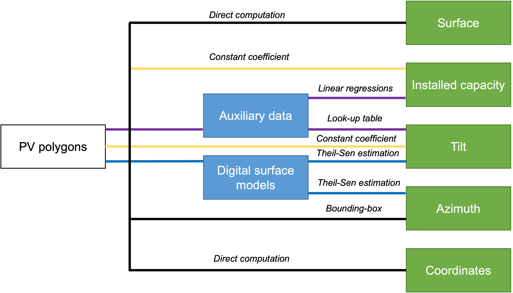

# PyPVRoof

A Python package for extracting characteristics of rooftop PV installations.

## Installation

You can install the package using pip:

```bash
pip install pypvroof
```

Or install from source:

```bash
git clone https://github.com/gabrielkasmi/pypvroof.git
cd pypvroof
pip install -e .
```

## Documentation

- [API Documentation](docs/api.md)
- [Tutorials](docs/tutorials/)
- [Examples](examples/)
- [Hands-on Notebook](notebooks/hands-on.ipynb)

## Quick Start

The supplementary data is accessible on our Zenodo repository: [](https://doi.org/10.5281/zenodo.7586879)

```python
import geojson
from pypvroof import MetadataExtraction


# load the data 
index =1356
arrays=geojson.load(open("path/to/geojson/with/arrays"))
case=arrays['features'][index]


# Example parameters dictionary
# choose your own methods
params = {
    "azimuth-method": "bounding-box", # choose between bounding-box and theil-sen
    "tilt-method": "lut", # choose between constant, lut and theil-sen
#    "raster-folder":"input" # specify the location of the raster as a .tif file if using theil-sen
    "regression-type": "linear", # choose between constant, linear or clustered
#    "constant-tilt": 30, # default parameters if no lookup table of DEM
#    "default-coefficient": 1/(6.5) # default parameter if no data to calibrate the linear regression coefficients
}

# initialize the object for extracting the metadata
extractor = MetadataExtraction(p=params)

# extract all characteristics at once for a single polygon
characteristics = extractor.extract_all_characteristics(case)


# or if you want a dataframe with all the characteristics for multiple polygons

dataframe = extractor.extract_all_characteristics(arrays)
```

## Repository Structure

```
pypvroof/
├── src/                    # Package source code
├── examples/              # Example scripts
│   ├── basic_usage.py
│   └── advanced_usage.py
├── notebooks/            # Jupyter notebooks
│   ├── hands-on.ipynb
│   └── advanced_features.ipynb
├── docs/                # Additional documentation
│   ├── api.md
│   └── tutorials/
├── tests/              # Test suite
├── setup.py
├── README.md
└── LICENSE
```

## Features

- Extract PV roof characteristics from GeoJSON polygons
- Support for multiple computation methods
- Custom lookup table support
- Flexible parameter configuration


The package is shipped with the lookup table for France used in [3] and array metadata from BDPV database and with a dataset of PV systems characteristics coming from BDPV if you want to use the linear regression for deriving the installed capacity of the system. 

## License

This project is licensed under the MIT License - see the LICENSE file for details.

## Overview and motivation

PyPVRoof is an all-in-one approach for extracting metadata of rooftop PV installations. The approach is modular, depending on the data available, we use different methods to extract these characteristics. The user only has to set his preferred parameters depending on the data available and the module will automatically proceed a single polygon or a complete `.geojson` file. We extract the following characteristics:

* Localization (latitude, longitude)
* Tilt angle
* Azimuth angle
* Surface
* Installed capacity

These characteristics can be deduced from overhead imagery and some additional data (a PV registry or surface models). Besides, these characteristics are sufficient for a broad range of application, e.g. surveying [1](https://arxiv.org/abs/2009.05738) or regional PV estimation [2](https://www.sciencedirect.com/science/article/abs/pii/S0038092X18308211)

This software offers practitionners a fast and efficient way to extract installations metadata to generate consistent registries. This work expands and completes the characteristics extraction module of [3](https://arxiv.org/abs/2207.07466). 

The flowchart of the package is summarized below:

<p align="center">

</p>

## Citation

If you wish to use this work, please cite us as: 

```
@article{tremenbert2023pypvroof,
  title={PyPVRoof: a Python package for extracting the characteristics of rooftop PV installations using remote sensing data},
  author={Tr{\'e}menbert, Yann and Kasmi, Gabriel and Dubus, Laurent and Saint-Drenan, Yves-Marie and Blanc, Philippe},
  journal={arXiv preprint arXiv:2309.07143},
  year={2023}
}
```

Like this work ? Do not hesitate to <a class="github-button" href="https://github.com/gabrielkasmi/pypvroof" data-icon="octicon-star" aria-label="Star gabrielkasmi/pypvroof on GitHub">star</a> us !

## References

[1] De Jong, T., Bromuri, S., Chang, X., Debusschere, M., Rosenski, N., Schartner, C., ... & Curier, L. (2020). Monitoring spatial sustainable development: semi-automated analysis of satellite and aerial images for energy transition and sustainability indicators. arXiv preprint arXiv:2009.05738.

[2] Killinger, S., Lingfors, D., Saint-Drenan, Y. M., Moraitis, P., van Sark, W., Taylor, J., ... & Bright, J. M. (2018). On the search for representative characteristics of PV systems: Data collection and analysis of PV system azimuth, tilt, capacity, yield and shading. Solar Energy, 173, 1087-1106.

[3] Kasmi, G., Dubus, L., Blanc, P., & Saint-Drenan, Y. M. (2022, September). Towards unsupervised assessment with open-source data of the accuracy of deep learning-based distributed PV mapping. In Workshop on Machine Learning for Earth Observation (MACLEAN), in Conjunction with the ECML/PKDD 2022.
