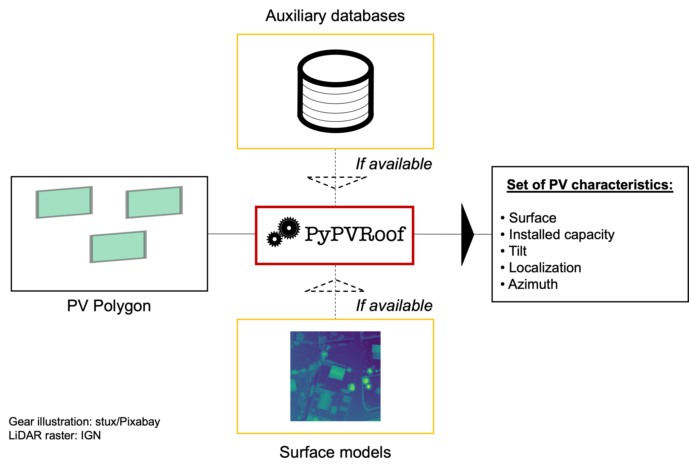

# `PyPVRoof`: a Python package for the modular extraction of minimal metadata or rooftop PV installations

## Overview and motivation

The supplementary data is accessible on our Zenodo repository: [](https://doi.org/10.5281/zenodo.7586879)


This repository provides an all-in-one approach for extracting metadata of rooftop PV installations. The approach is modular, depending on the data available, we use different methods to extract these characteristics. The user only has to set his preferred parameters depending on the data available and the module will automatically proceed a single polygon or a complete `.geojson` file. We extract the following characteristics:

* Localization (latitude, longitude
* Tilt angle
* Azimuth angle
* Surface
* Installed capacity

These characteristics can be deduced from overhead imagery and some additional data (a PV registry or surface models). Besides, these characteristics are sufficient for a broad range of application, e.g. surveying [1](https://arxiv.org/abs/2009.05738) or regional PV estimation [2](https://www.sciencedirect.com/science/article/abs/pii/S0038092X18308211)

This software offers practitionners a fast and efficient way to extract installations metadata to generate consistent registries. This work expands and completes the characteristics extraction module of [3](https://arxiv.org/abs/2207.07466). 

The flowchart of the package is summarized below:

<p align="center">

</p>

## Usage

We recommend that you create a virtual environment. With conda, you can do it as follows:

```python
  conda env create --file env.yml
  conda activate characteristics
```

### A minimal example 

You can use this module in you own scripts. You can do it as follows:

```python
  from src import main
  import geojson
  
  # Set up the dictionnary with the minimal parameters:
  p = {
    "azmiuth-method" : "bounding-box",
    'tilt-method'    : 'constant',
    'regression-type': "constant",
    "has-data"       : False,
    "has-dem"        : False,
    "output-name"    : "output",
    "data_dir"       : "data",
    "constant-tilt" : 30,
    "default-coefficient" : 1/(6.5)
  }
 
  # Initialize the characteristics extractor:
  extraction = main.MedatadataExtraction(p = p)
  
  # The polygon that will be passed as input is an item from
  # a geojson list. 
  polygons = geojson.load(open('path/to/your/input/file'))
  polygon = polygons[features][0] # take for instance the first element.
  
  # Compute the characteristics
  
  azimuth = extraction.compute_azimuth(polygon)
  tilt = extraction.compute_tilt(polygon)
  surface = extraction.compute_surface(polygon, tilt = tilt) 
  installed_capacity = extraction.compute_installed_capacity(polygon, tilt = tilt, surface = surface)
  
  # or, alternatively, extract all characteristics at once:
  characteristics = extraction.extract_all_characteristics(polygon, save_ext = False)
```
And that's it ! Your characteristics are returned as a `tuple` or a `pandas.DataFrame` depending on the number of polygons passed as input. If `save_ext` is set to `True`, then the `pandas.DataFrame` is saved in the `data_dir` directory.

### Mapping large inventories

Alternatively, if you want to extract the characteristics of a complete set of PV panel polygons, you can use this script as an executable. To do so, you'll need the following:
* Make sure that your input data is formatted as a `.geojson` file,
* Fill the `config.yml` file with your paths to the input and auxiliary files and the parameters,
* Run the executable `run.py` from the root folder to launch the extraction of the PV panel characteristics.

We recommend you follow the steps of our [hands-on notebook](https://github.com/gabrielkasmi/characteristics/blob/main/hands-on.ipynb) to see an example on how to run the module to extract a set of characteristics from a `.geojson` file. 

## Citation

If you wish to use this work, please cite us as: 

```
@article{

}
```

Like this work ? Do not hesitate to <a class="github-button" href="https://github.com/gabrielkasmi/pypvroof" data-icon="octicon-star" aria-label="Star gabrielkasmi/pypvroof on GitHub">star</a> us !

## References

[1] De Jong, T., Bromuri, S., Chang, X., Debusschere, M., Rosenski, N., Schartner, C., ... & Curier, L. (2020). Monitoring spatial sustainable development: semi-automated analysis of satellite and aerial images for energy transition and sustainability indicators. arXiv preprint arXiv:2009.05738.
[2] Killinger, S., Lingfors, D., Saint-Drenan, Y. M., Moraitis, P., van Sark, W., Taylor, J., ... & Bright, J. M. (2018). On the search for representative characteristics of PV systems: Data collection and analysis of PV system azimuth, tilt, capacity, yield and shading. Solar Energy, 173, 1087-1106.
[3] Kasmi, G., Dubus, L., Blanc, P., & Saint-Drenan, Y. M. (2022, September). Towards unsupervised assessment with open-source data of the accuracy of deep learning-based distributed PV mapping. In Workshop on Machine Learning for Earth Observation (MACLEAN), in Conjunction with the ECML/PKDD 2022.
